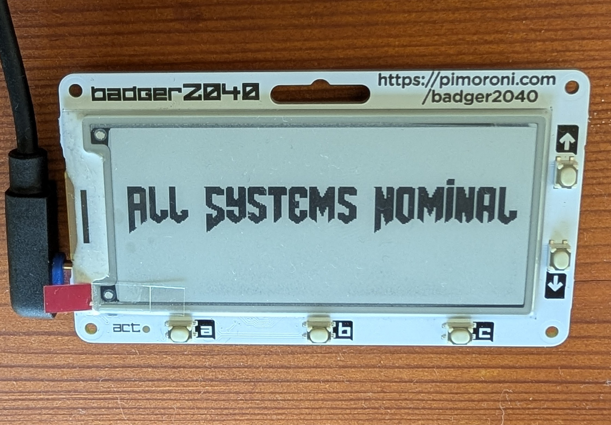

# Badger 2040 Docker Health Monitor

E-ink display on a NUC-connected Badger 2040 showing a daily-rotating
logo when all Docker containers are healthy, a breach-style alert
screen when something's down, and 5 physical buttons for switching
views, refreshing, scrolling, snoozing alerts, and restarting a
container.

<p align="center">
  
</p>

## Architecture

```
NUC (Docker host)                    Badger 2040 (CircuitPython)
------------------                   ---------------------------
docker_monitor.py                    code.py
  - polls Docker API      --USB-->     - reads framed image data,
  - renders bitmap                       draws it via displayio
  - sends over serial      <--USB--     - polls all 5 buttons,
  - listens for button                    sends a byte back per
    bytes, switches views                 press
  - restarts containers
    on confirmed request
```

Communication is bidirectional over one USB serial connection (the
Badger's dedicated "data" port, separate from its REPL console).

## Requirements

- NUC (or any always-on Linux box) running Docker
- Pimoroni Badger 2040 (non-W), running CircuitPython
- USB-C to Micro-USB (or matching) cable between them
- Your own collection of logos and breach warning images to display

## NUC Setup

```bash
sudo apt install python3-pip
python3 -m venv ~/docker-hud-env
source ~/docker-hud-env/bin/activate
pip install docker pillow pyserial
```

Add your user to the `dialout` group (needed for serial access), then
log out/in:
```bash
sudo usermod -aG dialout $USER
```

Set the correct timezone, if timestamps look off:
```bash
sudo timedatectl set-timezone Europe/Berlin
```

Edit `WATCHED_CONTAINERS` in `docker_monitor.py` to match your actual
container names (`docker ps --format '{{.Names}}'`).

Find the Badger's **data** serial port (there are two — console +
data, see Badger setup below):
```bash
ls /dev/ttyACM*
```

Run it:
```bash
python3 docker_monitor.py --port /dev/ttyACM1 --interval 60
```

## Badger Setup (CircuitPython)

1. Add to `boot.py` on the Badger — opens a second serial port
   dedicated to data, separate from the REPL console:
   ```python
   import usb_cdc
   usb_cdc.enable(console=True, data=True)
   ```
   Unplug/replug for it to take effect.
2. Copy the CircuitPython script onto the drive as `code.py` — the
   filename is arbitrary on your computer beforehand, but CircuitPython
   only auto-runs a file specifically named `code.py` (or `main.py`)
   at boot.
3. `board.DISPLAY` handles the e-ink panel natively — no extra driver
   library needed.

### What `code.py` actually does

It's a "dumb" client with two jobs, running in one loop:

- **Receives frames**: reads the image data `docker_monitor.py` sends
  (a small header with width/height, then packed black/white pixel
  data) and draws it via `displayio`. It has no idea what a container
  or an alert is — it just draws whatever bitmap arrives.
- **Sends button presses**: polls all 5 buttons (A, B, C, UP, DOWN)
  every ~50ms. On a debounced press, it sends a single identifying
  byte (`b"A"`, `b"B"`, etc.) back over the same serial connection.
  All the actual *meaning* of a button press (switch view, restart a
  container, ...) is decided on the NUC side, not here.

If a button doesn't register a press, the most likely cause is the
pull direction/polarity assumption in the script (`digitalio.Pull.DOWN`
+ pressed == `True`) not matching your specific unit — try flipping it
for that button.

## Views & Buttons

Cycle views with **B**: `auto` -> `containers` -> `stats` -> `auto` ...

| Button | `auto` view | `containers` view | `stats` view |
|---|---|---|---|
| **A** | Force refresh | Force refresh | Force refresh |
| **B** | -> `containers` | -> `stats` | -> `auto` |
| **C** | Snooze active alert (`--snooze-minutes`, default 30) | Arm restart on selected container; press again within 10s to confirm | no-op |
| **UP/DOWN** | Cycle logos manually (only while healthy) | Move selection cursor | no-op |

Restarting a container always requires two C presses (arm, then
confirm within 10s) — a stray single press never restarts anything.

## Logos & Breach Banner

Drop any number of `logo.jpg`, `logo1.jpg`, `logo2.jpg`, ... next to
`docker_monitor.py` on the NUC. One is picked at random each day
(stable all day, changes daily) and shown as the "all clear" screen.
No logos found -> falls back to an `X_X` text screen.

Drop a `breach.jpg` next to it too — shown as the banner at the top of
the alert screen. Missing -> falls back to a plain "!! WARNING !!"
text banner.

Preview any screen (including with fake data) using the `preview.py`
scratchpad — run in a local venv with just `pillow` installed, no
Docker/serial needed:
```python
logos = docker_monitor.list_logos()
img = docker_monitor.render_all_clear_screen(logo_path_override=logos[0])
```

## Run on boot (systemd)

Edit `docker-monitor.service`, fixing `User=` and the venv/script
paths, then:
```bash
sudo cp docker-monitor.service /etc/systemd/system/
sudo systemctl daemon-reload
sudo systemctl enable --now docker-monitor.service
```

Check status / logs:
```bash
systemctl status docker-monitor.service
journalctl -u docker-monitor.service -f
```

## License

MIT -- see `LICENSE`. Logo and breach image files are excluded from
this repo (`.gitignore`); supply your own.
